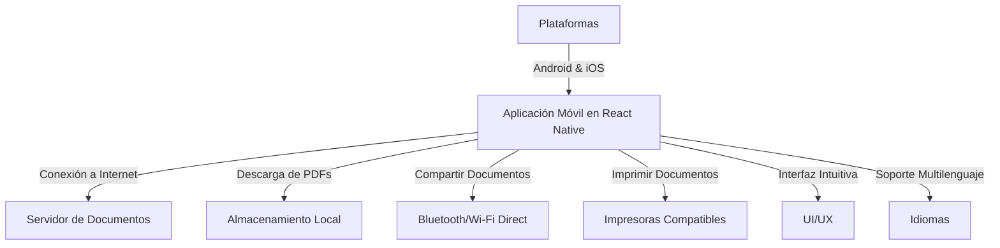

```mermaid
graph TD;
    A[Aplicación Móvil en React Native] -->|Conexión a Internet| B[Servidor de Documentos]
    A -->|Descarga de PDFs| C[Almacenamiento Local]
    A -->|Compartir Documentos| D[Bluetooth/Wi-Fi Direct]
    A -->|Imprimir Documentos| E[Impresoras Compatibles]
    A -->|Interfaz Intuitiva| F[UI/UX]
    A -->|Soporte Multilenguaje| G[Idiomas]
    H[Plataformas] -->|Android & iOS| A
```