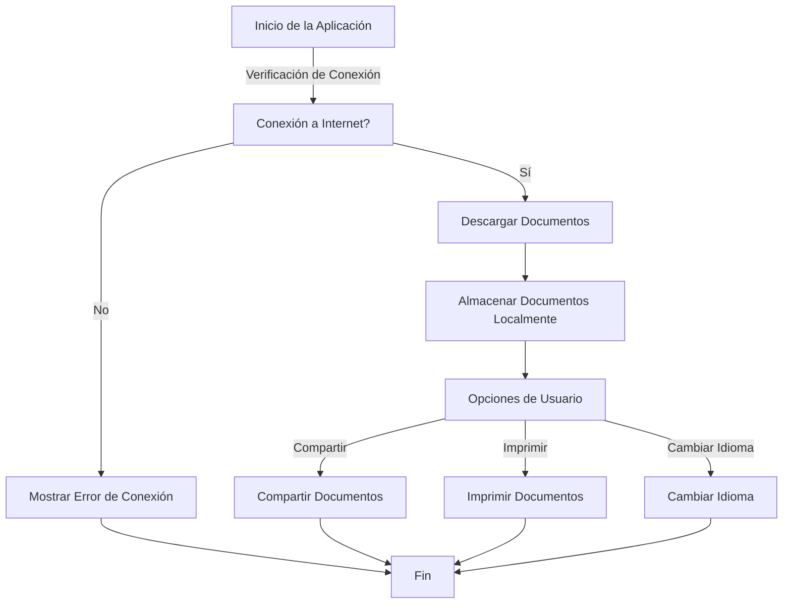

```mermaid
graph TD;
    Start[Inicio de la Aplicación] -->|Verificación de Conexión| CheckInternet[Conexión a Internet?]
    CheckInternet -->|Sí| DownloadDocs[Descargar Documentos]
    CheckInternet -->|No| ShowError[Mostrar Error de Conexión]
    DownloadDocs --> StoreLocally[Almacenar Documentos Localmente]
    StoreLocally --> Options[Opciones de Usuario]
    Options -->|Compartir| ShareDocs[Compartir Documentos]
    Options -->|Imprimir| PrintDocs[Imprimir Documentos]
    Options -->|Cambiar Idioma| ChangeLanguage[Cambiar Idioma]
    ShowError --> End[Fin]
    ShareDocs --> End
    PrintDocs --> End
    ChangeLanguage --> End
```